# objnull

> 象空 - 开源Github用户社区 [http://objnull.com/](http://objnull.com/) QQ群：612309214  

## 项目结构

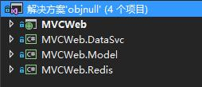  
* **MVCWeb.Redis**  
Redis缓存项目，提供Redis的访问。Redis用于存储经常访问的权限控制数据，消息通知，有时效性的临时数据。  
* **MVCWeb.Model**  
EntityFramework数据模型定义项目，包括了模型定义类和DBContext的定义和设置。
* **MVCWeb.DataSvc**  
数据CURD服务层，包括一个基础操作接口和实现和其他模型类的具体实现。
* **MVCWeb**  
具体网站项目。  

## 项目运行注意事项

1. **数据库**  
修改Web.config中连接字符串对应你本地计算机数据库，推荐使用MySQL。  
在**MVCWeb.Model**项目中**DBContext**文件夹修改类`MyDBContext`，切换注释设置数据库初始化器。  
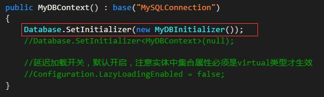  
直接运行就会生成对应数据库，不要手动建立。

2. **Redis**  
安装Redis并启动，推荐安装一个新的系统服务，端口和密码设置如下图则不用修改代码。  
在**MVCWeb.Redis**项目中**Base**文件夹下`MyRedisDBFactory`类修改Redis连接配置。  
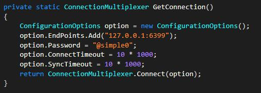  

3. **文件存储路径**  
在Web.config中`appSettings`节点下设置Key`BlogFilePath`和`NewBeeFilePath`的值为你想要的路径。

4. **cookie加密用向量和密钥**  
在`E:\ObjNullFile\`添加文件`Config.txt`，文件写两行文本，第一行16个随机字符作为向量，第二行32个随机字符作为密钥，不要是汉字。  
`E:\ObjNullFile\`实际来自Web.config中配置`NewBeeFilePath`项的路径，有问题在`Global.asax`文件中查看文件读取代码。

5. **权限控制**  
第一次运行注释**MVCWeb**项目**App_Start**文件夹**Filters.cs**文件中以下代码关闭权限控制  
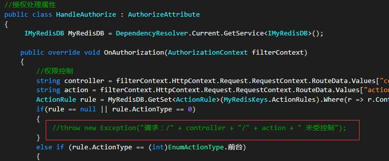  
运行成功后，访问`http://localhost:2221/Manager/Manage`页面进行后台管理。点击`一键生成ActionRule`后就可以取消注释开启权限控制。

一旦项目成功运行，具体结构和实现大家看看代码应该就能很快了解，有任何问题欢迎入群提问，下面对每个项目大概介绍一下。

## 项目介绍

### MVCWeb.Redis 

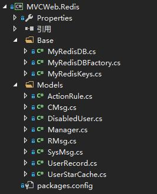  
该项目使用[StackExchange.Redis](https://github.com/StackExchange/StackExchange.Redis)连接和操作Redis。  
`Models`文件夹中为Redis中保存的对象的定义。  
`Base`文件夹中有三个文件  
* MyRedisDB  
该文件为Redis基础操作的接口和实现。  
* MyRedisDBFactory  
该文件为Redis连接配置和Redis管理对象的提供器。
* MyRedisKeys  
该文件为Redis中Key或Key前缀的常量定义。

### MVCWeb.Model  

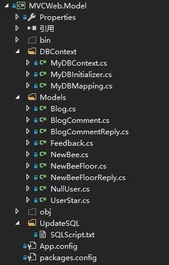  
`Models`文件夹中数据模型的定义。  
`DBContext`文件夹中有三个文件  
* MyDBContext  
该文件为DBContext的配置文件。  
* MyDBInitializer  
该文件为数据初始化器。  
* MyDBMapping  
该文件为模型和表映射配置，主要是外键映射配置。

`UpdateSQL`文件夹中文件用于记录后期手动添加表和字段的语句，发布时使用，不用关心。

### MVCWeb.DataSvc 

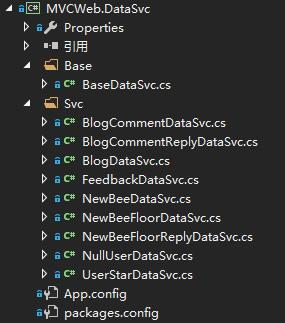  
`Base`文件夹中为基础数据操作的泛型接口和实现。  
`Svc`文件夹中为对应模型类的具体数据服务的实现。  
该项目的关键是文件`BaseDataSvc.cs`中的泛型接口和实现。一个模型只需添加一个具体实现即可获得基础操作，如下：
```
    //继承基础操作接口获得基础操作
    public interface IBlogCommentDataSvc : IBaseDataSvc<BlogComment>
    {
    }

    //继承基础操作实现
    public class BlogCommentDataSvc : BaseDataSvc<BlogComment>, IBlogCommentDataSvc
    {

    }
```
如有特殊的操作在此实现中添加接口和操作即可。

### MVCWeb  

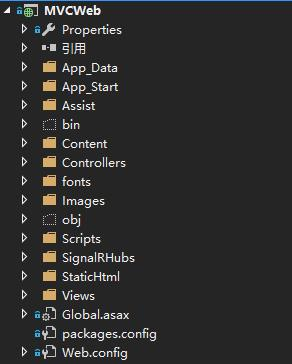  
* **App_Data**文件夹中为日志文件。  
* **App_Start**文件夹  
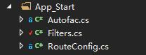  
`Autofac.cs`为Autofac的配置，提供DependencyResolver实现属性注入。  
`Filters.cs`为全局过滤器的定义，使用全局过滤器实现身份认证、权限管理和异常处理。  
`RouteConfig.cs`为路由配置文件。  
* **Assist**文件夹  
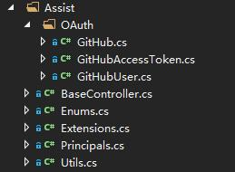  
`OAuth`文件夹中为GitHub OAuth登录所需的方法和接收数据的模型定义。  
`BaseController.cs`为Controller的基类，提供获取当前用户和管理员的属性。  
`Enums.cs`中为所以Enum类型的定义。  
`Extensions.cs`中为扩展方法的定义。  
`Principals.cs`中为实现**IPrincipal**的用户模型，用于身份认证中存储当前登录用户的信息。  
`Utils.cs`为静态工具类，加解密方法在此。  
* **Scripts**文件夹中**Views**文件夹中为具体页面引用的JavaScript文件，其他文件夹对应一个插件。  
* **SignalRHubs**文件夹  
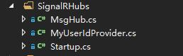  
`MsgHub.cs`为SignalR中客户端JS调用的服务端方法定义。  
`MyUserIdProvider.cs`为SignalR客户端ID获取方法定义。  
`Startup.cs`为使用Owin启动SignalR服务的启动器。  
* **StaticHtml**为用于展示特效的静态html页所在文件夹。

其他文件或文件夹意义同默认ASP.NET MVC项目，对应功能也顾名思义，不再赘述。


